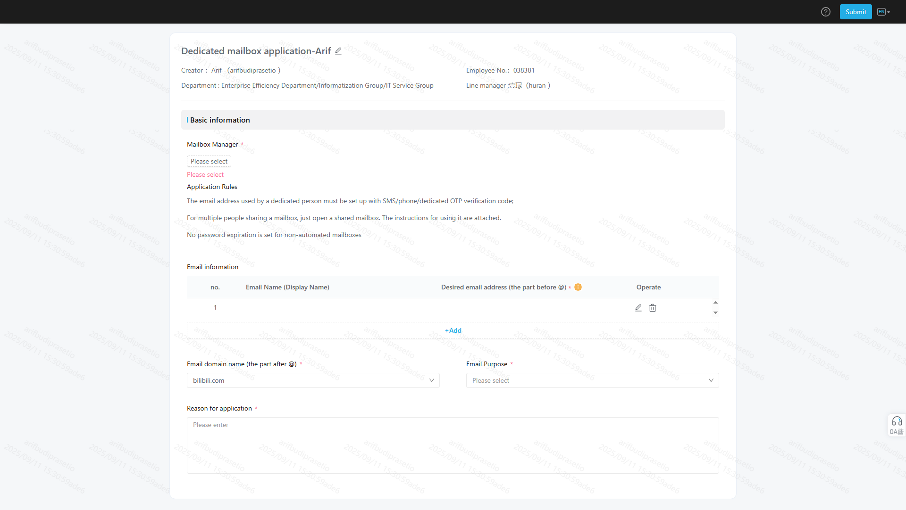

## Introduction
Teams and departments may require a **shared email account** for business communication, accessible by multiple members. You can request such an account through the internal approval system.  

---

## How to Apply
1. **Open the Request Link**  
   Visit the request form at:  
   [Department Email Account Form](https://shenpi.bilibili.co/workflow/15154767?refer=eac-pc&from=shenpi)  

2. **Fill in the Required Information**  
   Complete the form with the following details:  
   - **Mailbox Manager**:  
     - Can be a **dedicated person** (requires SMS/Phone/OTP verification), or  
     - **Multiple people** sharing the mailbox.  
   - **Desired Email Address and Domain** (choose from the listed domains).  
   - **Email Purpose**: Describe how the mailbox will be used.  
   - **Reason for Application**: Provide justification for creating the shared mailbox.  

3. **Submit the Form**  
   After filling in the details, submit the request for approval.  

---

## Approval Process
- The request will go through the standard **internal approval flow**.  
- Once approved, the shared mailbox will be created and ready for use by your department/team.  

---

## Notes
- Make sure to assign a responsible **Mailbox Manager** to oversee access and security.  
- For multiple users, ensure clear guidelines are set on who can access and manage the account.  
- SMS/Phone/OTP verification is required for mailbox manager setup.  

---

By following these steps, your department can efficiently request and manage a shared email account for collaborative use.

