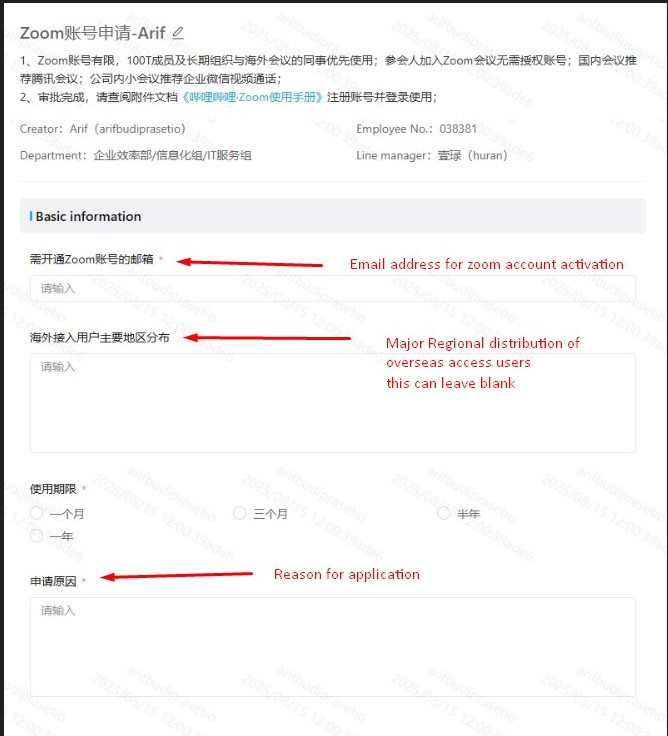

## Introduction
If you need a Zoom account for work purposes, you can request one through the company approval system. This process is straightforward and does **not** involve any department budget allocation.

---

## Request Process
1. **Open the Request Link**  
   Go to: [Zoom Request Form](https://shenpi.bilibili.co/workflow/14341?refer=eac-pc&from=shenpi)  
   

2. **Fill Out the Form**  
   - Provide all required details on the request form.  
   - Make sure your **registration email** is correct, as the activation link will be sent there after approval.  

3. **Approval Flow**  
   - The request will be automatically routed to your **line manager** for approval.  
   - Once approved, the system will send you an **activation link** via your registration email.  

## Activation
Once your request is approved:  
1. An **activation link** will be sent to the registration email you provided in the form.  
2. Open the link and follow the on-screen instructions to activate your Zoom account.
---

## Notes
- **No budget impact:** This request does **not** affect your department’s budget.  
- Ensure your registration email is **accessible** and **active** to receive the activation link.  
- If you do not receive the activation email within 2–3 working days after approval, contact IT Support.

---

